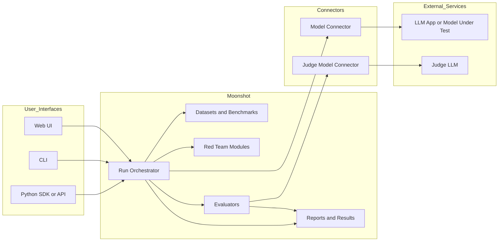
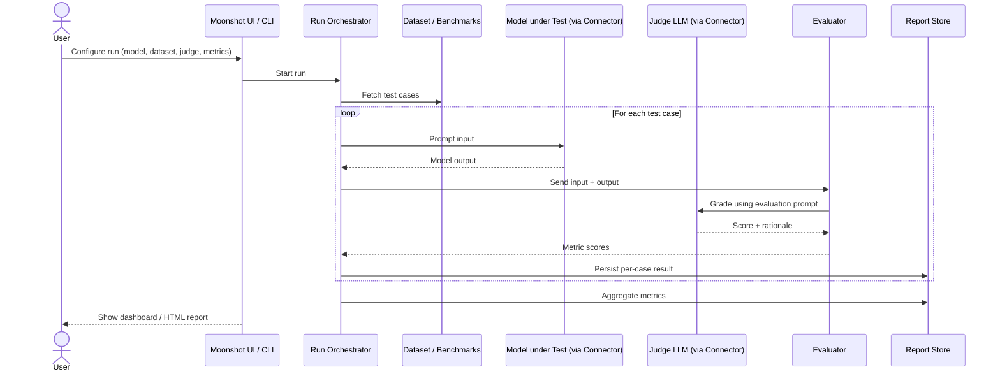
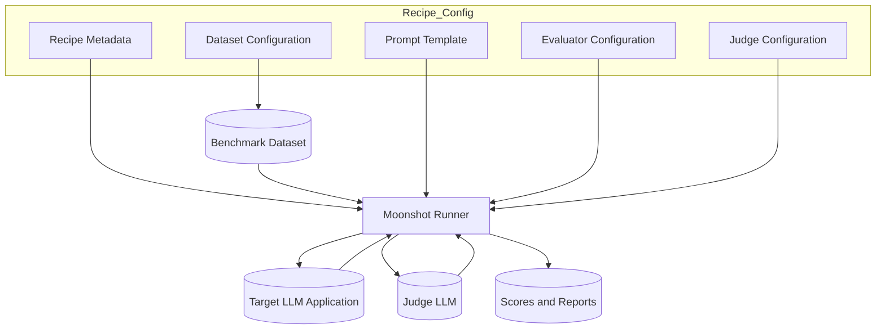
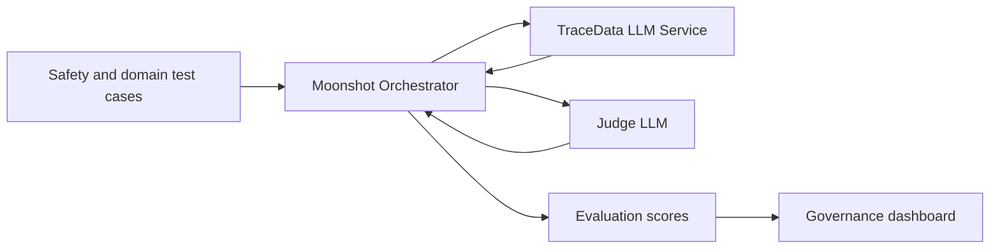
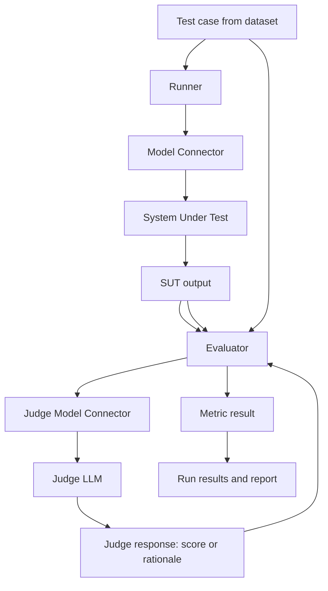
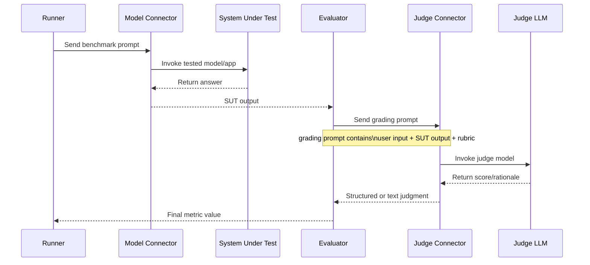
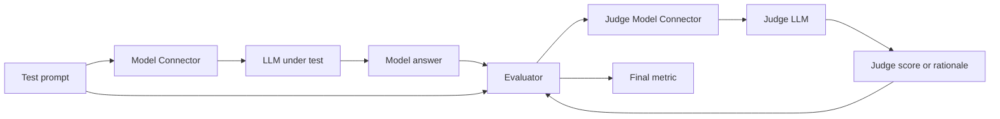
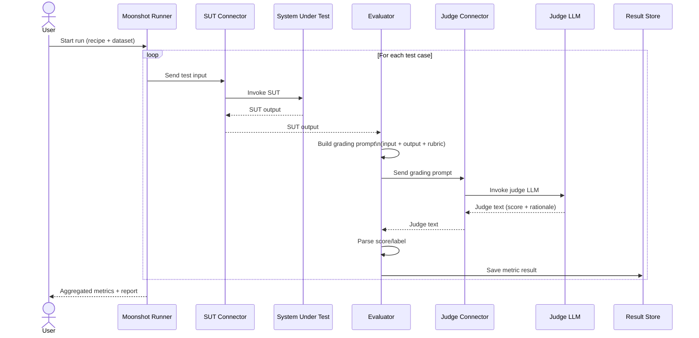

Project Moonshot doesn’t ship with its own foundation LLM; it’s an evaluation toolkit that connects to *other* LLMs and can also use LLMs as judges. [aiverifyfoundation](https://aiverifyfoundation.sg/project-moonshot/)

**1. Does Moonshot have an LLM inside?**  
- Moonshot is described as an “LLM evaluation toolkit” and “tool to bring benchmarking and red-teaming together,” not as a model. [aiverify-foundation.github](https://aiverify-foundation.github.io/moonshot/)
- It evaluates LLMs and LLM-based applications from providers like OpenAI, Anthropic, Together, Hugging Face via “Model Connectors”, where you plug in your own API keys. [aiverify-foundation.github](https://aiverify-foundation.github.io/moonshot/)
- So conceptually it’s more like LangSmith / TruLens / Ragas than like “its own ChatGPT/Kimi” model.

**2. Is it “LLM-as-a-judge”?**  
- Yes, Moonshot explicitly supports using “LLM-as-a-judge” evaluators as one of the ways to score model/app behavior. [imda.gov](https://www.imda.gov.sg/-/media/imda/files/about/emerging-tech-and-research/artificial-intelligence/starter-kit-for-testing-llm-based-applications-for-safety-and-reliability.pdf)
- The IMDA starter kit notes you can swap in different LLM-as-a-judge setups and define your own evaluation criteria in prompts (e.g., to measure refusal rate vs violation rate). [imda.gov](https://www.imda.gov.sg/-/media/imda/files/about/emerging-tech-and-research/artificial-intelligence/starter-kit-for-testing-llm-based-applications-for-safety-and-reliability.pdf)
- In practice, Moonshot bundles evaluators (e.g. safety, robustness, hallucination, etc.) and some of those evaluators are implemented via an LLM acting as a grader over the system outputs, similar in spirit to the Hugging Face LLM-as-a-judge cookbook. [huggingface](https://huggingface.co/learn/cookbook/llm_judge)

So: Moonshot itself = test harness + datasets + evaluators; the “judge” is one or more external LLMs invoked according to evaluator configs.

**3. High-level architecture (from public docs + starter kit)**  

At a simplified level:

1. **Config & Orchestration Layer**  
   - You define experiments: which model/app to test, which datasets, which evaluators, and thresholds. [aisp](https://aisp.sg/sig_article_sg_ai_testing_toolkit.html)
   - This layer also controls runs (benchmark runs, red-team runs) and aggregates metrics into reports. [aiverifyfoundation](https://aiverifyfoundation.sg/project-moonshot/)

2. **Model Connector Layer**  
   - Adapters for different model providers (OpenAI, Anthropic, Together, HuggingFace, custom HTTP endpoints). [aiverify-foundation.github](https://aiverify-foundation.github.io/moonshot/)
   - Each connector normalizes API calls so evaluators don’t care which provider you’re using. [aiverify-foundation.github](https://aiverify-foundation.github.io/moonshot/)

3. **Dataset & Scenario Layer**  
   - Library of >100 benchmark datasets (and growing) for safety, robustness, etc., plus red-teaming templates. [aisp](https://aisp.sg/sig_article_sg_ai_testing_toolkit.html)
   - You can use standard benchmarks or plug in your own domain-specific prompts. [aiverifyfoundation](https://aiverifyfoundation.sg/project-moonshot/)

4. **Evaluator Layer (including LLM-as-judge)**  
   - Built-in evaluators for safety, reliability, etc.; some are rule/metric-based (e.g. F1), others are LLM-based graders. [aisp](https://aisp.sg/sig_article_sg_ai_testing_toolkit.html)
   - LLM-as-judge evaluators call a judge model via its own connector, with configurable prompts and scoring logic. [imda.gov](https://www.imda.gov.sg/-/media/imda/files/about/emerging-tech-and-research/artificial-intelligence/starter-kit-for-testing-llm-based-applications-for-safety-and-reliability.pdf)
   - You can swap out the judge model or scoring prompt to align with your own safety definitions. [imda.gov](https://www.imda.gov.sg/-/media/imda/files/about/emerging-tech-and-research/artificial-intelligence/starter-kit-for-testing-llm-based-applications-for-safety-and-reliability.pdf)

5. **Reporting & Scoring Layer**  
   - Aggregates evaluator outputs into scores and dashboards so teams can compare models and track safety/quality over time. [aiverifyfoundation](https://aiverifyfoundation.sg/project-moonshot/)
   - Intended to support governance frameworks like the Model AI Governance Framework for Generative AI. [imda.gov](https://www.imda.gov.sg/resources/press-releases-factsheets-and-speeches/factsheets/2024/project-moonshot)


### 1. High‑level Moonshot system view



This shows Moonshot as orchestration + datasets + evaluators, calling out to external LLMs (both system‑under‑test and judge models) via connectors. [aiverify-foundation.github](https://aiverify-foundation.github.io/moonshot/)


### 2. Single benchmark run with LLM‑as‑a‑judge



This highlights how the “judge” is just another LLM accessed through the same connector layer, driven by an evaluator. [aiverify-foundation.github](https://aiverify-foundation.github.io/moonshot/)


### 3. Components of a custom “recipe” (benchmark config)



A “recipe” wires dataset + prompt template + metrics + judge config, and Moonshot’s runner executes it via the orchestrator. [aiverify-foundation.github](https://aiverify-foundation.github.io/moonshot/)




Yes — the **evaluator is the grader/scorer** in Moonshot. It takes the test case, the SUT output, and sometimes a judge model’s output, then computes the metric result that goes into the report. [aiverify-foundation.github](https://aiverify-foundation.github.io/moonshot/)

The key correction to your mental model is this: **the evaluator does not usually ask the same question to both the SUT and the judge as two equal respondents**; more commonly, the evaluator sends the test prompt to the **SUT**, gets the SUT’s answer, then sends a **grading prompt** to the **judge model** that includes the SUT answer and scoring instructions.  So the judge is usually grading the SUT’s answer, and the evaluator is the logic layer that prepares that grading task, parses the result, and turns it into a metric. [aiverify-foundation.github](https://aiverify-foundation.github.io/moonshot/)

## Core idea

Moonshot exposes separate APIs for **Connector Endpoint**, **Connector**, **Metric**, **Result**, **Run**, and **Runner**, which strongly suggests a pipeline where connectors fetch outputs and metrics/evaluators transform those outputs into scored results.  Moonshot also describes benchmarks as “exam questions” and red teaming as automated probing, so the evaluator’s job is essentially to decide **how well the model answered** or **whether it violated a rule**, then write that into the run results. [aiverify-foundation.github](https://aiverify-foundation.github.io/moonshot/)

## Main flow



In this flow, the **Model Connector** is just the adapter to the model or app being tested, and the **Judge Model Connector** is the adapter to whichever LLM you choose as judge.  The evaluator sits above both and uses them to produce a final metric such as pass/fail, numeric score, or violation label. [aiverify-foundation.github](https://aiverify-foundation.github.io/moonshot/)

## What the evaluator actually does

Think of the evaluator as doing four jobs: [aiverify-foundation.github](https://aiverify-foundation.github.io/moonshot/)

- **Collect context** — test input, expected rubric, SUT output, and sometimes reference answer. [aiverify-foundation.github](https://aiverify-foundation.github.io/moonshot/)
- **Call the judge if needed** — build a grading prompt and send it through the judge connector. [aiverify-foundation.github](https://aiverify-foundation.github.io/moonshot/)
- **Parse and normalize** — turn judge text like “Score: 2/5, harmful” into a structured metric value. [aiverify-foundation.github](https://aiverify-foundation.github.io/moonshot/)
- **Record the result** — save the per-case score into Moonshot’s result/run system. [aiverify-foundation.github](https://aiverify-foundation.github.io/moonshot/)

So the evaluator is not just “forwarding” traffic. It contains the **evaluation logic**. [aiverify-foundation.github](https://aiverify-foundation.github.io/moonshot/)

## Judge prompt flow



This is the usual LLM-as-a-judge pattern: the **judge sees the SUT answer and grades it**.  It is **not necessarily** “same raw question to both models and compare who answered better,” although you could design a custom evaluator that works that way. [aiverify-foundation.github](https://aiverify-foundation.github.io/moonshot/)

## If you use different judges

Yes — you can point the **Judge Model Connector** to different LLM endpoints, so you can swap judges as long as you provide the appropriate API key/endpoint for each one.  Moonshot says you provide your own API key for supported providers, and if you test your own hosted model/app, you create your own model connector. [aiverify-foundation.github](https://aiverify-foundation.github.io/moonshot/)

That means you could do setups like:

- SUT = your TraceData app, Judge = GPT-4o  
- SUT = Claude-based app, Judge = another Claude endpoint  
- SUT = Open-source local model, Judge = hosted commercial model  

All of that fits the connector model Moonshot documents. [aiverify-foundation.github](https://aiverify-foundation.github.io/moonshot/)

## If you really want “same question to both”

If you want this specific pattern:

1. Ask the same question to SUT  
2. Ask the same question to judge  
3. Compare both outputs  
4. Score similarity / correctness / safety  

that is **possible as a custom evaluation design**, but it is not the default mental model you should start with.  The simpler and more standard model is: **SUT answers, judge grades, evaluator computes score**. [aiverify-foundation.github](https://aiverify-foundation.github.io/moonshot/)

## Best mental model

Use this sentence:

> **Connector gets outputs, evaluator turns outputs into scores.** [aiverify-foundation.github](https://aiverify-foundation.github.io/moonshot/)

And if a judge LLM is involved:

> **Evaluator asks the judge to grade the SUT output, then converts that judgment into a metric result.** [aiverify-foundation.github](https://aiverify-foundation.github.io/moonshot/)

## Simplified diagram



Here, the evaluator is the “brain” of the scoring step, while the connectors are just the “plugs” that reach external systems. [aiverify-foundation.github](https://aiverify-foundation.github.io/moonshot/)

If you want, I can do one more thing for you next:  
I can draw **two side-by-side Mermaid diagrams**:

- **Standard Moonshot LLM-as-a-judge flow**
- **Your mistaken-but-common mental model: same question to both judge and testee**

and label exactly where they differ.


You’ve got it basically right, and your concern about “how can an LLM objectively grade from A–F or 1–5” is exactly the core limitation people worry about with LLM‑as‑a‑judge. [confident-ai](https://www.confident-ai.com/blog/why-llm-as-a-judge-is-the-best-llm-evaluation-method)

Let me separate three things:

1. **What the evaluator actually does in Moonshot**  
2. **How an LLM judge can output A–F / 1–5 even though it’s “just text”**  
3. **Why this is *not* perfectly objective, and how people try to make it less bad**

***

## 1. What the evaluator does (conceptually)

Your restatement is correct:

- The evaluator **does not** usually “ask the same question to both” and then just compare.  
- Instead, it:
  1. Takes the test case (input, maybe reference answer). [aiverify-foundation.github](https://aiverify-foundation.github.io/moonshot/resources/metrics/)
  2. Sends the input to the **model under test** via the Model Connector → gets SUT output. [github](https://github.com/aiverify-foundation/moonshot)
  3. Builds a **grading prompt** that includes:
     - the original question  
     - the model’s answer  
     - possibly a reference answer / context / policy  
     - a scoring rubric (e.g., “give a score 1–5 and explanation”). [huggingface](https://huggingface.co/learn/cookbook/llm_judge)
  4. Sends that grading prompt to the **judge LLM** via the judge connector. [aiverify-foundation.github](https://aiverify-foundation.github.io/moonshot/resources/metrics/)
  5. Parses the judge’s reply into a numeric or categorical score (0–1, 1–5, A–F, pass/fail, etc.). [aiverify-foundation.github](https://aiverify-foundation.github.io/moonshot/resources/metrics/)
  6. Stores that as the **metric result** for the test case. [aiverify-foundation.github](https://aiverify-foundation.github.io/moonshot/resources/metrics/)

Moonshot’s metric catalog shows exactly this pattern in many metrics: some rely on embeddings / classical math (e.g. AnswerCorrectness ~ 0–1 semantic similarity), others explicitly call out “Judge LLM” or “Annotator” metrics that count “yes/no” or classify responses using a judge model’s output. [aiverify-foundation.github](https://aiverify-foundation.github.io/moonshot/resources/metrics/)

***

## 2. How an LLM judge can produce A–F or 1–5 scores

Even though an LLM is “just text”, you **force** it to behave like a grader by:

1. **Giving it a rubric** (definition of what 1 vs 5 means)  
   Example from Hugging Face cookbook: ask for a **“Total rating: 1 to 4”** with detailed descriptions for each number; the judge must output a number plus explanation. [towardsdatascience](https://towardsdatascience.com/llm-as-a-judge-a-practical-guide/)

2. **Constraining the output format**  
   E.g.:
   - “Return only: `Score: <number between 1 and 5>` and `Explanation: <text>`.” [confident-ai](https://www.confident-ai.com/blog/why-llm-as-a-judge-is-the-best-llm-evaluation-method)
   - Or categories like “Excellent / Acceptable / Could be Improved / Bad” that you later map to numbers in code. [huggingface](https://huggingface.co/learn/cookbook/llm_judge)

3. **Parsing the judge’s text back into a number**  
   - Your evaluator code extracts the “Total rating: X” or the label and converts it into a numeric score. [huggingface](https://huggingface.co/learn/cookbook/llm_judge)
   - For example, map `Excellent→4, Acceptable→3, Could be Improved→2, Bad→1`. [huggingface](https://huggingface.co/learn/cookbook/llm_judge)

So even though the LLM is not doing “math” internally, you’re treating it as a **fancy classifier** that maps (question, answer, rubric) → (label, explanation). [confident-ai](https://www.confident-ai.com/blog/why-llm-as-a-judge-is-the-best-llm-evaluation-method)

***

## 3. Why it’s *not* perfectly objective (and what people do about it)

You’re totally right to be suspicious about “objectively” grading with an LLM. There’s a lot of evidence that LLM judges:

- **Have scoring bias** depending on rubric phrasing, label order, scale, or reference scores. [arxiv](https://arxiv.org/html/2506.22316v2)
- Can be inconsistent on numeric scales; small prompt changes can drastically change score distributions. [arize](https://arize.com/blog-course/numeric-evals-for-llm-as-a-judge/)

Research and practice highlight several issues:

- **Score rubric order bias** (changing the order of “1=bad, 5=good” can shift scores). [arxiv](https://arxiv.org/html/2506.22316v2)
- **Score ID bias** (using emotive labels like “Excellent” vs neutral labels). [arxiv](https://arxiv.org/html/2506.22316v2)
- **Reference answer bias** (if a reference answer is shown with a high score, the judge tends to mimic that). [aiverifyfoundation](https://aiverifyfoundation.sg/downloads/Cataloguing_LLM_Evaluations.pdf)
- **General numeric instability**: numeric scores from LLM judges aren’t consistently calibrated across prompts/versions, and you shouldn’t over‑interpret small differences. [arize](https://arize.com/blog-course/numeric-evals-for-llm-as-a-judge/)

To partially fix this, people do things like: [godaddy](https://www.godaddy.com/resources/news/calibrating-scores-of-llm-as-a-judge)

- Use **very explicit rubrics** (detailed description per score level). [godaddy](https://www.godaddy.com/resources/news/calibrating-scores-of-llm-as-a-judge)
- Prefer **few buckets** (e.g. 3–4 levels) instead of fine‑grained 1–10 numeric scales. [arize](https://arize.com/blog-course/numeric-evals-for-llm-as-a-judge/)
- Use **relative / comparison scoring** (judge picks better of two answers) instead of absolute numeric scores. [towardsdatascience](https://towardsdatascience.com/llm-as-a-judge-a-practical-guide/)
- Aggregate multiple judge runs or multiple judge models. [arxiv](https://arxiv.org/html/2506.22316v2)
- Treat LLM‑as‑a‑judge as a **scalable approximation** to human scoring, validated against human “gold” where possible, not as an oracle. [aiverifyfoundation](https://aiverifyfoundation.sg/downloads/Cataloguing_LLM_Evaluations.pdf)

Moonshot’s metric list reflects this: some metrics are purely numeric (0–1 similarity, precision/recall), others rely on “Judge LLM”, “FlagJudge Annotator”, or “General Judge LLM” to count yes/no or classify responses.  These are **not “objective math”**; they’re formalized heuristics built on top of LLM judgments. [aiverify-foundation.github](https://aiverify-foundation.github.io/moonshot/resources/metrics/)

***

## How to phrase it in your head

Your understanding now is basically:

> Evaluator = logic that uses LLM‑as‑a‑judge like a programmable grader: given a rubric and an answer, ask the judge to choose a label or score, then convert that to a metric.

That’s exactly right. Just keep in mind:

- It **does not** make grading perfectly objective; it makes grading **scalable and somewhat consistent, if carefully designed and calibrated**. [confident-ai](https://www.confident-ai.com/blog/why-llm-as-a-judge-is-the-best-llm-evaluation-method)
- For critical things (safety, compliance), you still want to benchmark and calibrate your LLM judge against human reviewers and/or simpler, more objective metrics. [imda.gov](https://www.imda.gov.sg/-/media/imda/files/about/emerging-tech-and-research/artificial-intelligence/singapore-ai-safety-red-teaming-challenge-evaluation-report.pdf)

If you’d like, next I can give you:

- A concrete **example evaluator prompt** for TraceData (e.g., “rate driver‑risk summary from 1–4 for hallucinations and safety violations”), plus  
- How you’d parse that into a numeric metric in code, Moonshot‑style.


Here are several different Mermaid views of LLM‑as‑a‑judge in Moonshot, with the nuanced bits called out.

***

### 1. End‑to‑end Moonshot run with LLM‑as‑a‑judge

```mermaid
flowchart LR
    subgraph Config
        RCP[Recipe\n(dataset + metrics + judge cfg)]
    end

    subgraph Moonshot_Run
        RUN[Runner]
        EVL[Evaluator\n(metric logic)]
    end

    subgraph Connectors
        SUTC[Model Connector\n(SUT endpoint)]
        JCON[Judge Connector\n(judge LLM endpoint)]
    end

    subgraph External_Systems
        SUT[(LLM App / Model Under Test)]
        JLLM[(Judge LLM)]
    end

    DATA[(Benchmark Dataset)]
    RES[(Results & Reports)]

    RCP --> RUN
    DATA --> RUN

    RUN --> SUTC
    SUTC --> SUT
    SUT --> RUN

    RUN --> EVL
    EVL --> JCON
    JCON --> JLLM
    JLLM --> EVL

    EVL --> RES
```

Nuances here: the **Evaluator** is the “brains” of scoring; connectors are just IO plumbing. [aiverify-foundation.github](https://aiverify-foundation.github.io/moonshot/)

***

### 2. What the evaluator does internally (per test case)

```mermaid
flowchart TB
    TC[Test Case\n(input + optional reference)]
    OUT[Model Output\n(from SUT)]
    GRPROMPT[Grading Prompt\n(input + output + rubric)]
    JRESP[Judge Response\n(text)]
    SCORE[Parsed Score\n(1–5, A–F, pass/fail)]
    META[Metadata\n(labels, rationale)]
    REC[Metric Record]

    TC --> OUT
    OUT --> GRPROMPT
    TC --> GRPROMPT

    GRPROMPT --> JRESP

    JRESP --> SCORE
    JRESP --> META

    SCORE --> REC
    META --> REC
```

Key nuance: the evaluator is **constructing a grading problem**, not just forwarding the original user question. [aiverify-foundation.github](https://aiverify-foundation.github.io/moonshot/)

***

### 3. Sequence diagram of the full interaction



Nuances:

- There are **two “questions”**:
  - Q1 to the SUT: “answer this user/task prompt”.  
  - Q2 to the judge: “given the prompt, answer, and rubric, grade it”.  
- The evaluator owns Q2 and the parsing of the judge’s answer. [huggingface](https://huggingface.co/learn/cookbook/llm_judge)

***

### 4. Comparing your initial mental model vs actual LLM‑as‑a‑judge

```mermaid
flowchart LR
    subgraph Your_Initial_Model
        Q1[Test Input]
        Q1 --> SUT_A[Ask SUT]
        Q1 --> JUDGE_A[Ask Judge]
        SUT_A --> OUT_A[SUT Answer]
        JUDGE_A --> JOUT_A[Judge Answer]
        OUT_A & JOUT_A --> COMP[Compare answers]
        COMP --> SCORE_A[Score]
    end

    subgraph Actual_LLM_as_Judge
        Q2[Test Input]
        Q2 --> SUT_B[Ask SUT]
        SUT_B --> OUT_B[SUT Answer]

        OUT_B & Q2 --> GP[Build Grading Prompt\n(+ rubric)]
        GP --> JUDGE_B[Ask Judge to grade]
        JUDGE_B --> JOUT_B[Judge Score + Rationale]
        JOUT_B --> SCORE_B[Score]
    end
```

Nuance: in the real pattern, **judge is not a second contestant**; it’s a grader given the SUT’s answer and explicit instructions. [confident-ai](https://www.confident-ai.com/blog/why-llm-as-a-judge-is-the-best-llm-evaluation-method)

***

### 5. Evaluator variants: non‑LLM metric vs LLM‑as‑a‑judge

```mermaid
flowchart TB
    subgraph Non_LLM_Metric
        A1[Input + Output + Reference]
        A2[Compute numeric metric\n(e.g. BLEU, exact match,\nvector similarity)]
        A3[Return numeric score]
        A1 --> A2 --> A3
    end

    subgraph LLM_as_Judge_Metric
        B1[Input + Output + Rubric\n(+ optional reference)]
        B2[Construct grading prompt]
        B3[Call Judge LLM]
        B4[Parse judge text\ninto label/score]
        B5[Return metric score]
        B1 --> B2 --> B3 --> B4 --> B5
    end
```

Nuance: evaluator can be **pure math** or **LLM‑based**; LLM‑as‑a‑judge is just one evaluator pattern in Moonshot’s metric catalog. [aiverify-foundation.github](https://aiverify-foundation.github.io/moonshot/resources/metrics/)

***

### 6. Where bias and calibration live

```mermaid
flowchart LR
    RUB[Rubric Design\n(scale, labels, wording)]
    PROMPT[Grading Prompt Template]
    JUDGE_MODEL[Judge LLM Choice]
    EVAL_IMPL[Evaluator Implementation\n(prompt + parser)]
    RESULTS[Metric Distributions\n(over many test cases)]

    RUB --> PROMPT
    PROMPT --> EVAL_IMPL
    JUDGE_MODEL --> EVAL_IMPL
    EVAL_IMPL --> RESULTS
```

Nuances:

- The “objectivity” of A–F or 1–5 is heavily influenced by:
  - rubric wording & label order,  
  - judge model choice,  
  - how strictly you parse and map outputs. [arxiv](https://arxiv.org/html/2506.22316v2)
- This is why people talk about calibrating LLM‑as‑a‑judge scores and validating them against human labels. [aiverifyfoundation](https://aiverifyfoundation.sg/downloads/Cataloguing_LLM_Evaluations.pdf)

***

If you want, next I can:

- Draft a **TraceData‑specific evaluator** (LLM judge prompt + parsing scheme) as if you were adding a “Hallucination & Safety Score” metric into Moonshot.