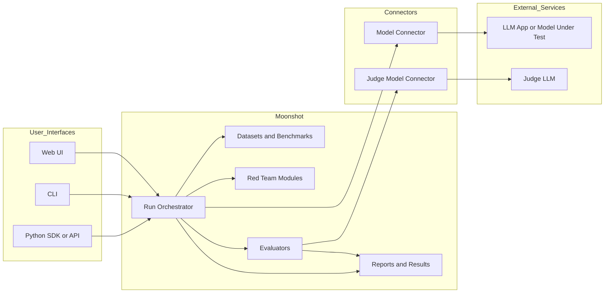
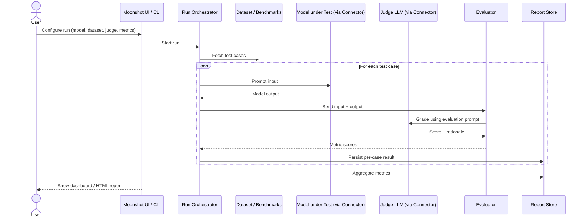
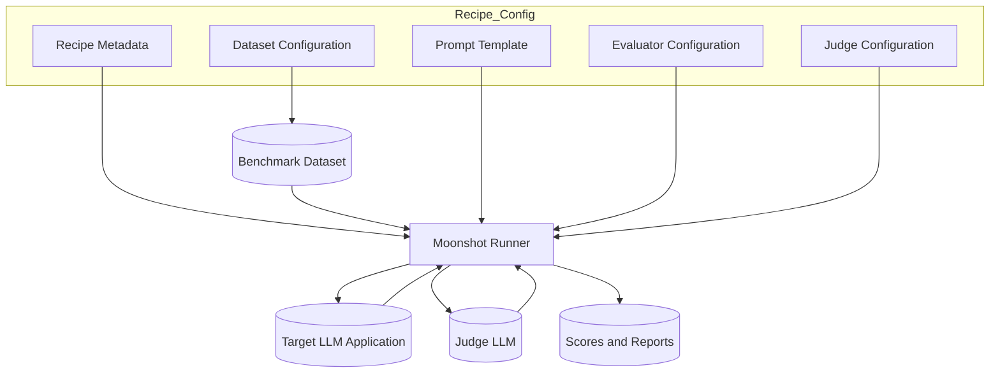
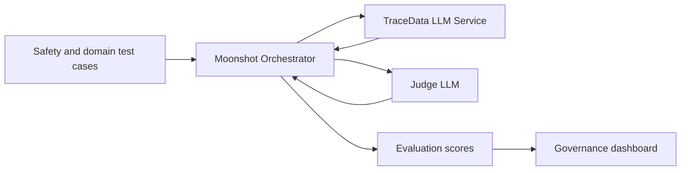

Project Moonshot doesn’t ship with its own foundation LLM; it’s an evaluation toolkit that connects to *other* LLMs and can also use LLMs as judges. [aiverifyfoundation](https://aiverifyfoundation.sg/project-moonshot/)

**1. Does Moonshot have an LLM inside?**  
- Moonshot is described as an “LLM evaluation toolkit” and “tool to bring benchmarking and red-teaming together,” not as a model. [aiverify-foundation.github](https://aiverify-foundation.github.io/moonshot/)
- It evaluates LLMs and LLM-based applications from providers like OpenAI, Anthropic, Together, Hugging Face via “Model Connectors”, where you plug in your own API keys. [aiverify-foundation.github](https://aiverify-foundation.github.io/moonshot/)
- So conceptually it’s more like LangSmith / TruLens / Ragas than like “its own ChatGPT/Kimi” model.

**2. Is it “LLM-as-a-judge”?**  
- Yes, Moonshot explicitly supports using “LLM-as-a-judge” evaluators as one of the ways to score model/app behavior. [imda.gov](https://www.imda.gov.sg/-/media/imda/files/about/emerging-tech-and-research/artificial-intelligence/starter-kit-for-testing-llm-based-applications-for-safety-and-reliability.pdf)
- The IMDA starter kit notes you can swap in different LLM-as-a-judge setups and define your own evaluation criteria in prompts (e.g., to measure refusal rate vs violation rate). [imda.gov](https://www.imda.gov.sg/-/media/imda/files/about/emerging-tech-and-research/artificial-intelligence/starter-kit-for-testing-llm-based-applications-for-safety-and-reliability.pdf)
- In practice, Moonshot bundles evaluators (e.g. safety, robustness, hallucination, etc.) and some of those evaluators are implemented via an LLM acting as a grader over the system outputs, similar in spirit to the Hugging Face LLM-as-a-judge cookbook. [huggingface](https://huggingface.co/learn/cookbook/llm_judge)

So: Moonshot itself = test harness + datasets + evaluators; the “judge” is one or more external LLMs invoked according to evaluator configs.

**3. High-level architecture (from public docs + starter kit)**  

At a simplified level:

1. **Config & Orchestration Layer**  
   - You define experiments: which model/app to test, which datasets, which evaluators, and thresholds. [aisp](https://aisp.sg/sig_article_sg_ai_testing_toolkit.html)
   - This layer also controls runs (benchmark runs, red-team runs) and aggregates metrics into reports. [aiverifyfoundation](https://aiverifyfoundation.sg/project-moonshot/)

2. **Model Connector Layer**  
   - Adapters for different model providers (OpenAI, Anthropic, Together, HuggingFace, custom HTTP endpoints). [aiverify-foundation.github](https://aiverify-foundation.github.io/moonshot/)
   - Each connector normalizes API calls so evaluators don’t care which provider you’re using. [aiverify-foundation.github](https://aiverify-foundation.github.io/moonshot/)

3. **Dataset & Scenario Layer**  
   - Library of >100 benchmark datasets (and growing) for safety, robustness, etc., plus red-teaming templates. [aisp](https://aisp.sg/sig_article_sg_ai_testing_toolkit.html)
   - You can use standard benchmarks or plug in your own domain-specific prompts. [aiverifyfoundation](https://aiverifyfoundation.sg/project-moonshot/)

4. **Evaluator Layer (including LLM-as-judge)**  
   - Built-in evaluators for safety, reliability, etc.; some are rule/metric-based (e.g. F1), others are LLM-based graders. [aisp](https://aisp.sg/sig_article_sg_ai_testing_toolkit.html)
   - LLM-as-judge evaluators call a judge model via its own connector, with configurable prompts and scoring logic. [imda.gov](https://www.imda.gov.sg/-/media/imda/files/about/emerging-tech-and-research/artificial-intelligence/starter-kit-for-testing-llm-based-applications-for-safety-and-reliability.pdf)
   - You can swap out the judge model or scoring prompt to align with your own safety definitions. [imda.gov](https://www.imda.gov.sg/-/media/imda/files/about/emerging-tech-and-research/artificial-intelligence/starter-kit-for-testing-llm-based-applications-for-safety-and-reliability.pdf)

5. **Reporting & Scoring Layer**  
   - Aggregates evaluator outputs into scores and dashboards so teams can compare models and track safety/quality over time. [aiverifyfoundation](https://aiverifyfoundation.sg/project-moonshot/)
   - Intended to support governance frameworks like the Model AI Governance Framework for Generative AI. [imda.gov](https://www.imda.gov.sg/resources/press-releases-factsheets-and-speeches/factsheets/2024/project-moonshot)

### 1. High‑level Moonshot system view

This shows Moonshot as orchestration + datasets + evaluators, calling out to external LLMs (both system‑under‑test and judge models) via connectors. [aiverify-foundation.github](https://aiverify-foundation.github.io/moonshot/)

### 2. Single benchmark run with LLM‑as‑a‑judge

This highlights how the “judge” is just another LLM accessed through the same connector layer, driven by an evaluator. [aiverify-foundation.github](https://aiverify-foundation.github.io/moonshot/)

### 3. Components of a custom “recipe” (benchmark config)

A “recipe” wires dataset + prompt template + metrics + judge config, and Moonshot’s runner executes it via the orchestrator. [aiverify-foundation.github](https://aiverify-foundation.github.io/moonshot/)

